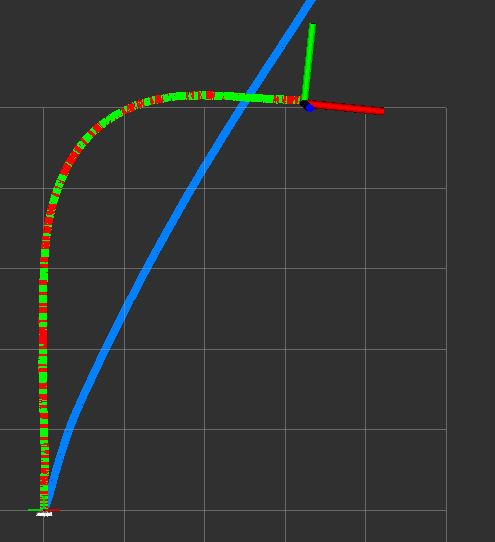
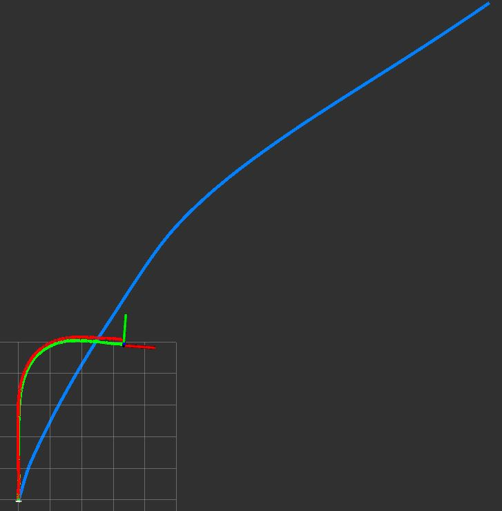
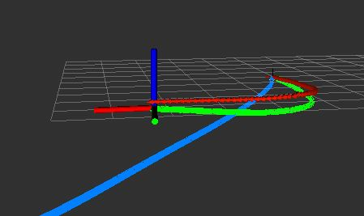

# Sensor Fusion with Robot Pose EKF

A ROS node for tracking and visualizing odometry + IMU data based on robot_pose_ekf

HW4_0780827 Gerald Baulig

GitHub [https://github.com/bugerry87/sdc.git]

## Remarks

Please notice that this projects contains a customized version of `robot_pose_ekf`.
To avoid conflicts this customized version is renamed to `robot_pose_ekf_0780827`.
Make sure that all 3 packages of this project get build:

1. `robot_pose_ekf_0780827`
2. `hw3_0780827`
3. `hw4_0780827`

The version `robot_pose_ekf_0780827` recoveres all functionallity of the original version.
There is no need to remove the transformer operations if the transformer tree is setup properly.
Furthermore, the parameter-set got extended for more individual runtime configurations.

## Environment

Tested on:

- Ubuntu 18.04.4 LTS + ROS Melodic 1.14.5 + Python 3.6.9
- Ubuntu 16.04 LTS + ROS Kinetic 1.12.7 + Python 3.5.2

## Requirements

**apt-get**

- python3-tk
- ros-kinetic-navigation

**pip3**

- rospy
- rospkg
- numpy
- scipy

## Installation

1. Clone this package into to `src` of your catkin workspace.

2. Ensure that all ROS environment variables are set. i.e.:

```
$ source /opt/ros/melodic/setup.sh
$ source ~/catkin_ws/devel/setup.sh
```

3. Ensure the ROS-Core is running with i.e.: `$ roscore &`

4. Navigate to your catkin workspace i.e.: `$ cd ~/catkin_ws`

5. Make all the the packages i.e.: 

```
$ catkin_make --pkg robot_pose_ekf_0780827
$ catkin_make --pkg hw3_0780827
$ catkin_make --pkg hw4_0780827
```

Done!

## Quick Run

For a simple run make sure the following files are executable:

```
hw3_0780827/src/imu_viz_node.py
hw4_0780827/src/imu_remap_node.py
hw4_0780827/src/track_viz_node.py
```

Then launch the `hw4_node`:

```
$ roslaunch hw4_0780827 hw4_node
//or
$ roslaunch hw4_0780827 hw4_node_tf
```

**Note:** The `hw4_node_tf` uses the `robot_pose_ekf` as recommended!
It setups the `tf` transform-tree correctly, such that the IMU data doesn't need to be adjusted in advance.

Now all nodes are ready and `rviz` should start automatically.
Play a rosbag as follows for a an example:

```
$ rosbag play ~/Desktop/sdc_hw3.bag -r 0.9 --clock
```

**Note:** Since we use `tf` transformers the argument `--clock` is required,
because `tf` has problem to manage senor data from the past.
Therefore, we simulate the time-domain of the sensors.

## Sensor Orientation Correction

The IMU is mounted upside-down. Therefore, we need to rotate the IMU data.
The rotation matix from IMU to camera is provided as:

```
IMU
| 0.0225226  0.999745    0.0017194 |
| 0.0648765 -0.00317777  0.997888  |
| 0.997639  -0.0223635  -0.0649315 |
```

While the ZED data is rotated to cameras Z-axis:

```
ZED
|  0  0 1 |
| -1  0 0 |
|  0 -1 0 |
```

Hence, we need to combine these rotation matices and extract the quaternion.
Please check the tool `tools/rmat2quat`.
The resulting quaternion for the IMU is:

```
[0.99940885 -0.01122809 -0.03247131 0.00122501].T
```

This quaternion is used as a parameter for the node `IMUremap` (see `launch/hw4_node`).

## Q&A

### 1. What’s the difference between our launch (robot_pose_ekf.launch) file and original launch file? And please explain why we add these modification.

**Answer:**
The statement `<remap from="vo" to="/zed/odom" />` remaps the topic `vo` to `/zed/odom`,
such that `robot_pose_ekf` will understand `/zed/odom` as the topic `vo` which got subscribed in the source code.

**Commend:**
Please take a look at `hw4_0780827/launch/hw4_node` to see how much more a launch-file can do for us.
The `hw4_node` defines a set of arguments whose can be set in the launch command.
Thus we can adjust the topic as follows:

```
$ roslunch hw4_0780827 hw4_node vo_topic:=/zed/odom
```

Furthermore, the launch setup the required `tf` transform-tree and starts all required nodes.
Finally it runs the `rviz` tool with a preset configuration.

### 2. Which parts in IMU data and ZED odometry are used? And please explain why it choose this way.(odom_estimation_node.cpp)

**Answer:**
Only the 3D orientation of the IMU is considered,
while the full 3D pose of the visual odometry (ZED) is considered.

The IMU has a strong gravity reference
and therewith suitable for finding the original orientation to the world,
while the meassured translation is very inaccurate.

The visual odometry (ZED) is strong in position and orientation estimation.
However, the estimation is relative to the visual input
but cannot tell its orientation to the gravity axis.
Generally speaking, if the camera is tilted, the entire world would be assumed to be tilted

Therefore, we merge the gravity orientation into the visual orientation.
After few measurements the EKF will eliminate the tilts of the sensor mounting.

### 3. Please try to adjust covariance setting in odom_estimation_node.cpp (in imuCallback() & voCallback()), and observe how it affect the resulting path. Also, give your opinion which setting Is better, and why?

**Answer:**
Please have a look in the `hw4_0780827/launch/hw4_node` and see,
the covariances of IMU and ZED (vo) are now to be set via the arguments `imu_cov` and `vo_cov`.
Furthermore, we fix the covariances via `fix_imu_cov` and `fix_vo_cov`.
A launch command could look as follows:

```
$ roslaunch hw4_0780827 hw_node vo_cov:="[0.1,0.17,0.0]" fix_vo_cov:=true \
  imu_cov:="[2.86e-8,2.86e-8,2.86e-8]" fix_imu_cov:=true
```

The parameter `imu_cov` set the diagonals of the IMU covariance matix according to the values
and won't change over the entire runtime by setting `fix_imu_cov:=true`.
Otherwise, the covariances would get adjusted by the sensor information.
Note that the first value of `vo_cov` sets the diagonal covariances of the translation component
while the second value sets the diagonal covariances of the rotation component.
The last value controls the rest of the 6x6 covariance matrix.
Hence, we try to respect the orientation of the `imu_cov` more than of `vo_cov`.
If we would set the rotation component of `vo_cov` to a very small value,
the rotation component of `vo_cov` would dominate the model:

```
$ roslaunch hw4_0780827 hw4_node vo_cov:="[0.9, 0.00000001, 0.0]" fix_vo_cov:=true
```



### 4. Comparing the resulting path and the single sensor paths, what is the difference, and why?

**Answer:**
The difference is unsignificant in `images/hw4_node.jpg`.
The combined (green) track hits the 90° curve more precisely.
However, the screenshot `images/hw4_node_side.jpg` shows that the gravity drift of both sensors got almost eliminated.





**Comment:**
I can't reproduce the curve according to the task-sheet as reference,
although, the result of the task-sheet looks more inaccurate than mine.

## Diskussion

In this assignment we employed the `robot_pose_ekf` to merge the IMU and ZED data and visualized those with aditional python nodes.

However, I realized why (you) used to remove the transformer correction in `robot_pose-ekf` because the current implemented transformer-tree is less intuitive to use.
It should be almost considered to be a bug of `robot_pose-ekf`. The current tree is:

- world
  - map
    - output
        - base
          - imu
          - vo

Normally, we would assume `base` is our robot and each sensor has a separate child node, since each sensor could be individually mounted.
Then, an inverse transformation would correct the sensor data according to our `base`.
However, `base` is currently used to correct the IMU orientation,
while the child nodes `vo` and `imu` are used to store the individual estimation of each sensor
and `output` is the orientation to the `map`,
while `map` is just a corrector for the final output to the visualizaion space `world`.
Hence, a corrector for `vo` is missing and its transformation has actually no effect.
On the other hand, if we turn `imu` upside-down, the entire output will flip upside-down, because the IMU is expected to be the ground truth orientation.
Thus, the EKF will assume our camera would be mounted upside-down and we need to correct the `output` frame.
I will do further investigation and hope to contribute a fixed version.

## Conclusion

In this assignment we've learned how to define an advanced launch file
and run several nodes simutanously including `rviz`, 
how to use `tf` transformers,
how to remap sensor data
and how to perform sensor fusion by using EKF.
The experiments with the covariances demonstrated how we can control the consideration of each sensor's odometry component.